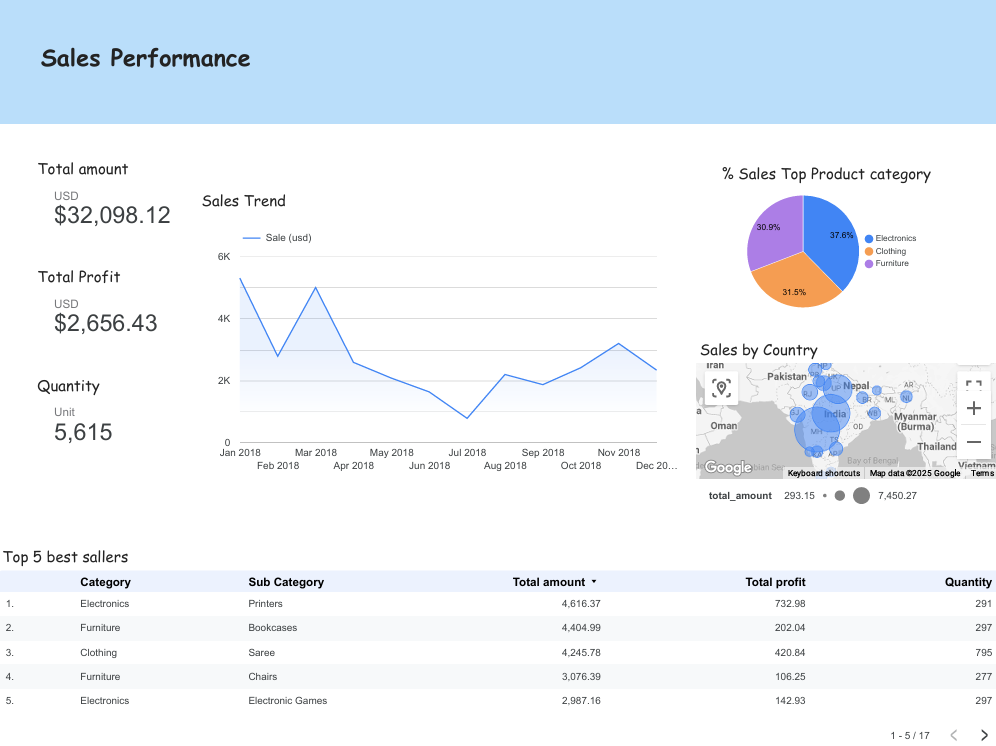
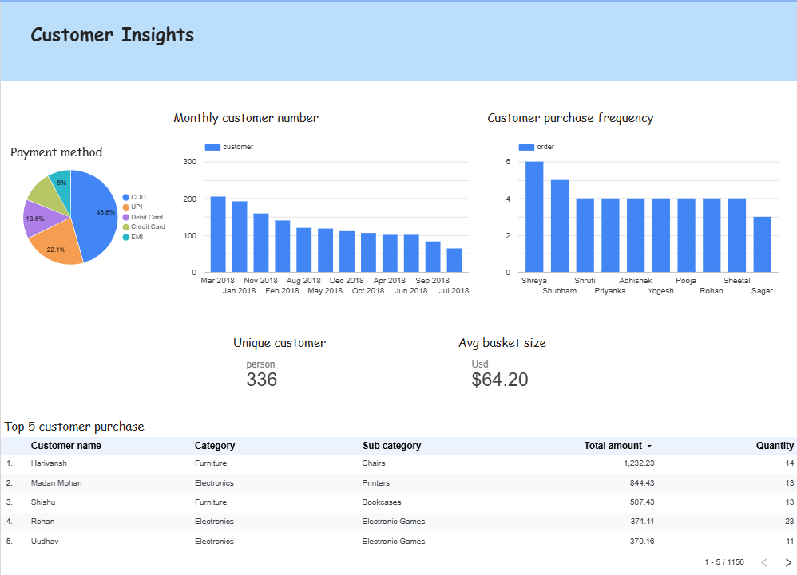
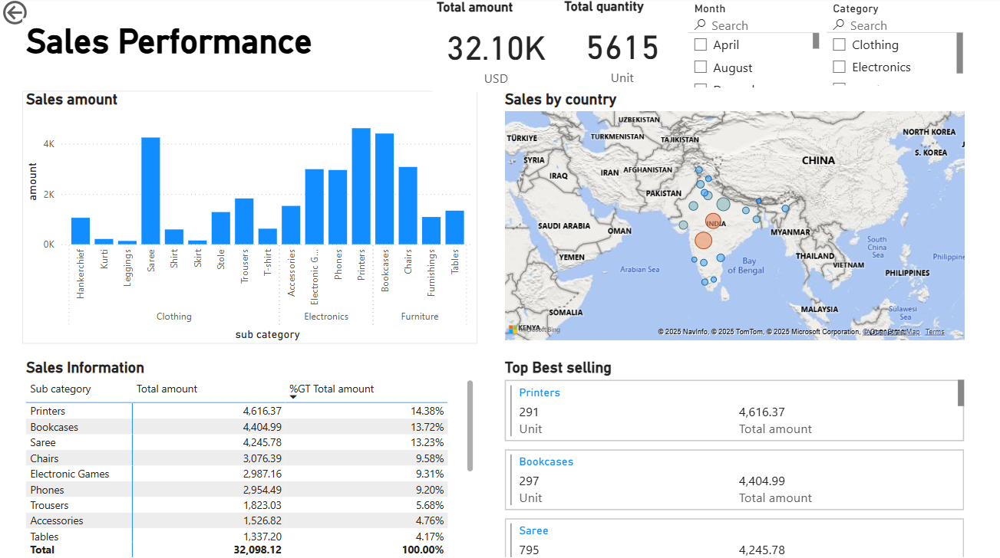
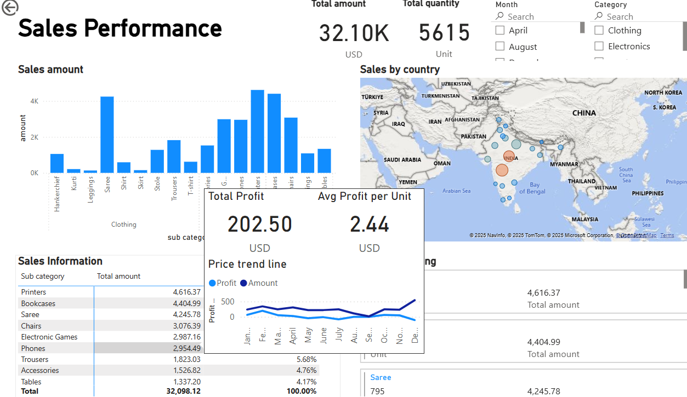
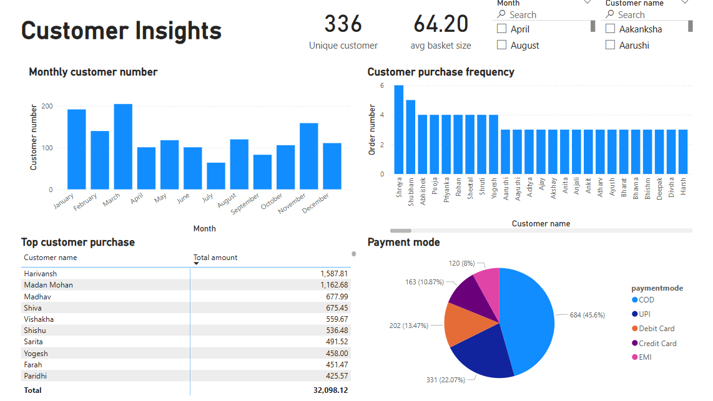
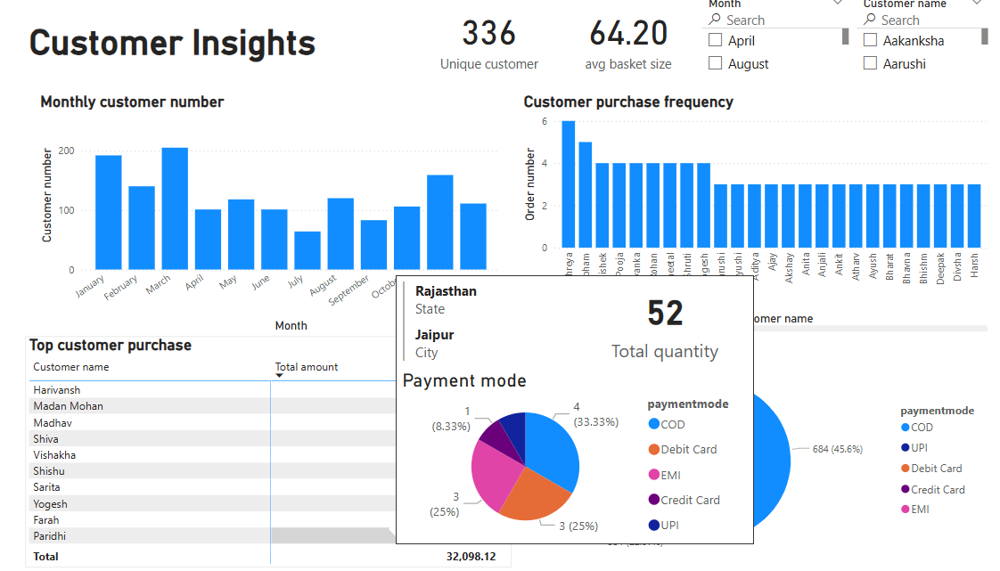

# Market online sales dashbord
This notebook is designed to prepare and clean datasets before uploading them to Google BigQuery, making them ready for further analysis and dashboard creation in Looker Studio (formerly known as Data Studio) and Power BI.

---

## Project Overview

- Source dataset from Kaggle 
- Clean and transform data using Python and Pandas
- Export cleaned data to a Parquet file
- Upload dataset to Google BigQuery
- Convert order_date from integer to date format using SQL
- Connect to Looker Studio or Power BI to build interactive dashboards

---

## How to Use

 1. Download the notebook or raw dataset 
    - if using the notebook, configure Kaggle API and set up Colab secret to download dataset
    - You can obtain your Kaggle API key from your Kaggle profile.
 
 2. Upload parquet file to Google BigQuery via BigQuery UI
    - After upload, use the following SQL to convert the order_date column from integer to date formate

        ```
        CREATE TABLE `your_project.data_set.table` AS
        SELECT
            order_id,
            DATE(TIMESTAMP_MICROS(CAST(order_date / 1000 AS INT64))) AS order_date,
            usd_amount,
            usd_profit,
            quantity,
            total_amount,
            total_profit,
            category,
            sub_category,
            paymentmode,
            customername,
            state,
            city
        FROM `your_project.data_set.table`

            ```
3. Open Looker Studio or Power BI
    - Connect your BigQuery dataset
    - Build and customize your dashboard

---

## Result dashboard

Looker Studio Dashboard


    



Power BI Dashboard








     

## Dataset Source
Online sales dataset : https://www.kaggle.com/datasets/samruddhi4040/online-sales-data

Curency conversion rate : https://www.kaggle.com/datasets/meetnagadia/us-dollar-inr-rupee-dataset20032021


